# Sales Medallion Data Pipeline

A Databricks-centric Azure Data Engineering project that ingests external GitHub source files into ADLS Gen2, processes them through Bronze/Silver/Gold Delta layers, builds a Gold star schema, and exposes the Gold Delta data through Synapse Serverless SQL.

## Architecture


## Project structure

```text
Sales-Medallion-Data-Pipeline/
├── README.md
├── databricks.yml                  # Bundle root (dev target)
├── azure-pipelines.yml             # Azure DevOps CI/CD
├── requirements.txt                # Local-only (data generator)
├── architecture/
│   └── architecture.png            # Architecture diagram
├── docs/
│   ├── architecture.md
│   ├── ci-cd.md
│   └── project-boundaries.md
├── resources/
│   └── sales_medallion_job.yml     # Databricks job (4 serverless tasks)
├── src/                            # Databricks notebooks
│   ├── 01_ingest_raw.py
│   ├── 02_bronze.py
│   ├── 03_silver.py
│   └── 04_gold.py
├── synapse/                        # Synapse Serverless SQL scripts
│   ├── README.md
│   ├── 01_create_database.sql
│   ├── 02_create_master_key_and_credential.sql
│   ├── 03_create_external_data_source.sql
│   ├── 04_gold_views.sql
│   └── 05_test_queries.sql
├── tools/
│   └── generate_sales_medallion_source_data.py
└── snapshots/                      # Execution screenshots (01-14), see below
```

## Repositories

This project uses two logical repositories:

- `sales-data-source` — external GitHub repository containing CSV/JSON source files.
- `Sales-Medallion-Data-Pipeline` — project code, Databricks bundle, Synapse SQL, documentation, and architecture.

## Source data

Expected source repository structure:

```text
sales-data-source/
├── customers/
│   ├── customers_001.csv
│   └── customers_002.csv
├── products/
│   └── products.json
├── stores/
│   └── stores.csv
└── orders/
    ├── orders_001.csv
    └── orders_002.csv
```

`tools/generate_sales_medallion_source_data.py` can generate the source data repository contents.

## ADLS layout

Keep the physical lake layout simple:

```text
sales-lake/
├── raw/
│   ├── customers/
│   ├── products/
│   ├── stores/
│   └── orders/
├── bronze/
├── silver/
└── gold/
```

The ingestion notebook mirrors the GitHub source tree under `raw/`. The Bronze/Silver/Gold notebooks create table-specific Delta directories automatically.

## Unity Catalog

Catalog:

```text
sales_catalog
├── bronze
├── silver
└── gold
```

The Delta tables are external tables stored in the existing ADLS Gen2 `sales-lake` container.

## Azure and Unity Catalog setup

### 1. Azure resources

Resource group `rg-sales-medallion` containing the Azure Databricks workspace, the Access Connector for Azure Databricks, and the ADLS Gen2 storage account.

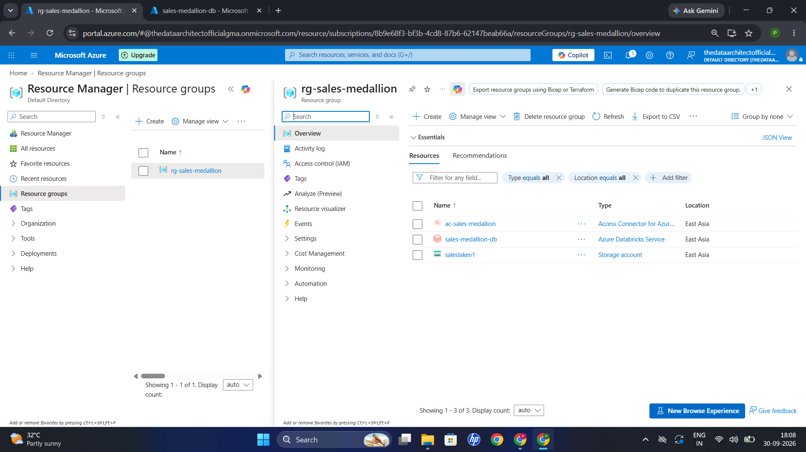

### 2. Storage credential

A Unity Catalog storage credential (`cred-sales-adls`) backed by the Access Connector's managed identity.

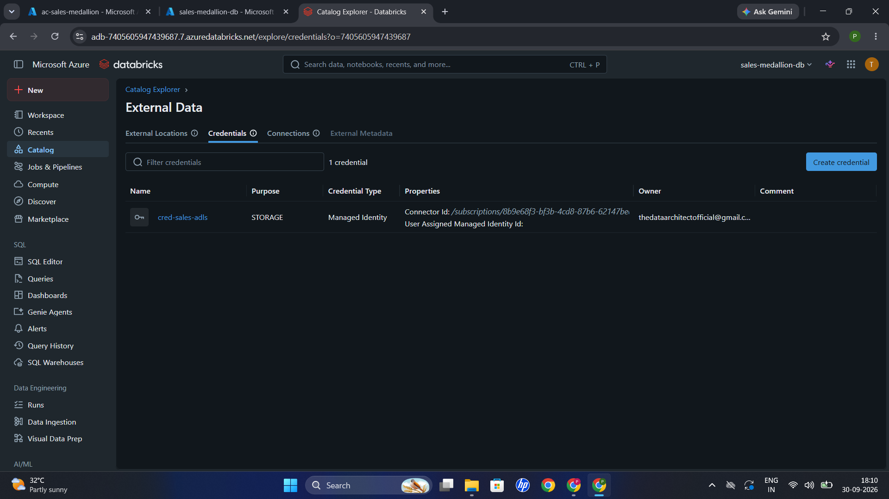

### 3. External location

External location `ext_sales_lake` pointing to the `sales-lake` container, using the credential above.

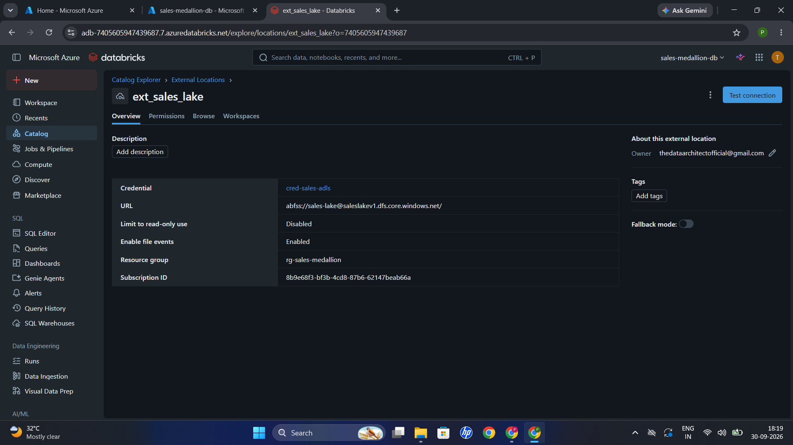

### 4. Storage access for the Access Connector

The Access Connector's managed identity is given the **Storage Blob Data Contributor** role on the storage account.

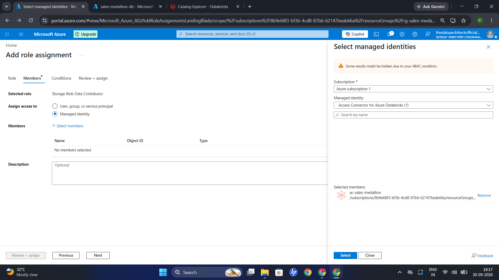

### 5. Grants on the external location

`CREATE EXTERNAL TABLE` is granted on `ext_sales_lake` so the notebooks can create external Delta tables.

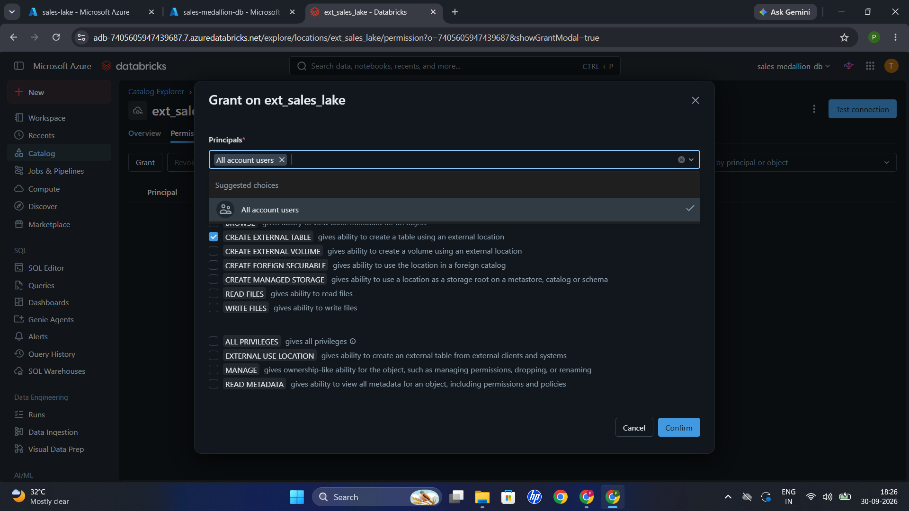

## Notebook flow

### 01_ingest_raw.py

Discovers all files in the GitHub source repository and lands them under `sales-lake/raw/`.

No business transformations happen here.

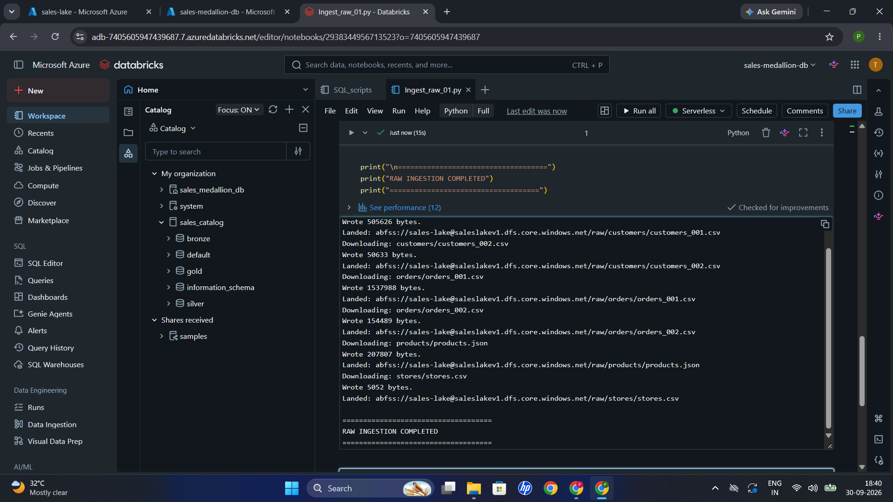

### 02_bronze.py

Reads CSV and JSON files from `raw/`, adds technical metadata, and writes external Delta tables:

```text
sales_catalog.bronze.customers
sales_catalog.bronze.products
sales_catalog.bronze.stores
sales_catalog.bronze.orders
```

With Unity Catalog, `_metadata.file_path` is used instead of `input_file_name()`.

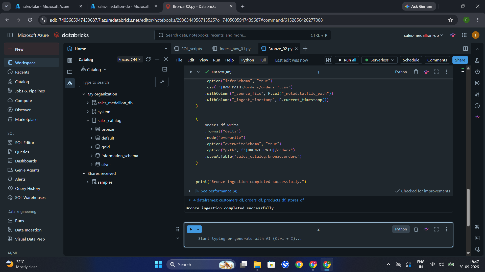

### 03_silver.py

Cleans and standardizes the data:

- datatype casting
- trimming/standardization
- email normalization
- deduplication
- invalid value filtering
- order amount calculation

Customer SCD Type 2 is deliberately handled in Gold rather than Silver.

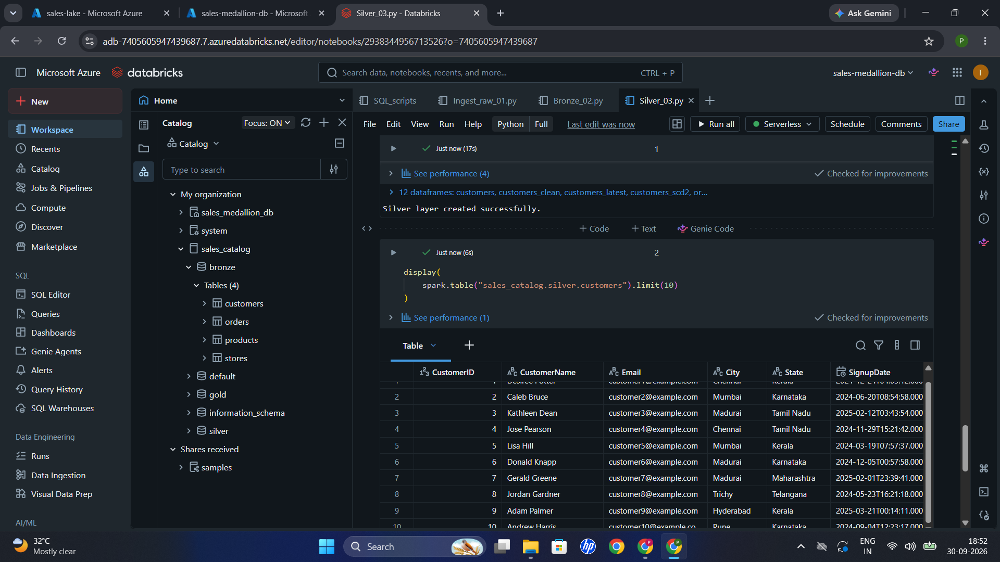

### 04_gold.py

Builds a dimensional Gold layer:

```text
sales_catalog.gold.dim_customer
sales_catalog.gold.dim_product
sales_catalog.gold.dim_store
sales_catalog.gold.dim_date
sales_catalog.gold.fact_sales
```

`dim_customer` is SCD Type 2.

`fact_sales` grain:

> One row per order line/product within an order.

Measures:

- Quantity
- UnitPrice
- SalesAmount

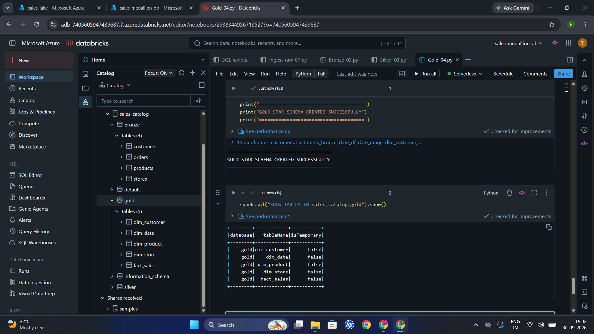

## Gold star schema

```text
                 dim_customer
                      |
                      |
dim_date ------ fact_sales ------ dim_product
                      |
                      |
                  dim_store
```

Surrogate keys are generated as SHA-256 hashes in the Databricks code for deterministic, portable key generation.

## Synapse Serverless

Synapse is used only as a SQL access layer over the Gold Delta data in ADLS.

No dedicated SQL pool is used.
No second physical copy of Gold data is created.

The Synapse database contains a `gold` schema with views:

```text
gold.fact_sales
gold.dim_customer
gold.dim_product
gold.dim_store
gold.dim_date
```

The views use `OPENROWSET(... FORMAT='DELTA')` against the Gold Delta folders.

Synapse workspace creation (linked to the `sales-lake` storage account):

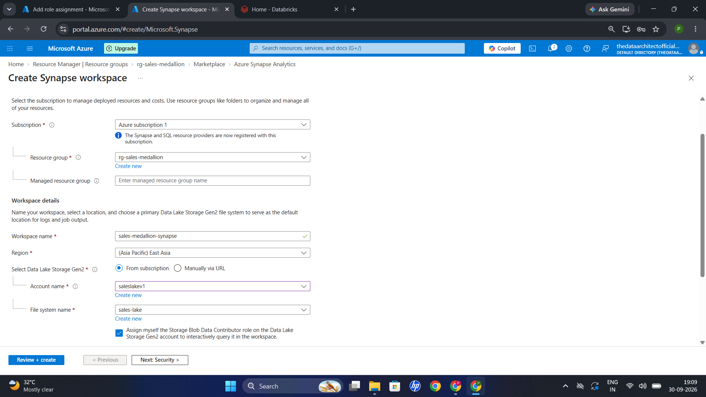

Reading the Gold `fact_sales` Delta folder directly with `OPENROWSET`:

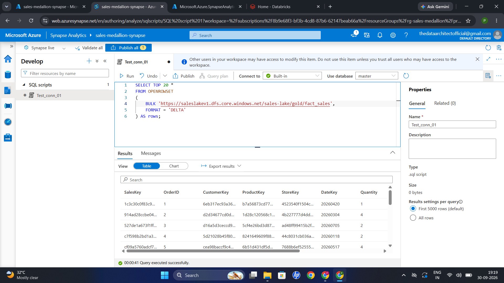

Validating the `gold` schema and dimension views in the `SalesMedallion` database:

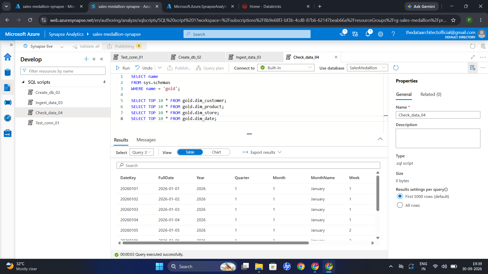

See [`synapse/README.md`](synapse/README.md) for the script execution order.

## Databricks Job

The working job flow is:

```text
ingest_raw
    |
    v
bronze
    |
    v
silver
    |
    v
gold
```

Job run in progress:

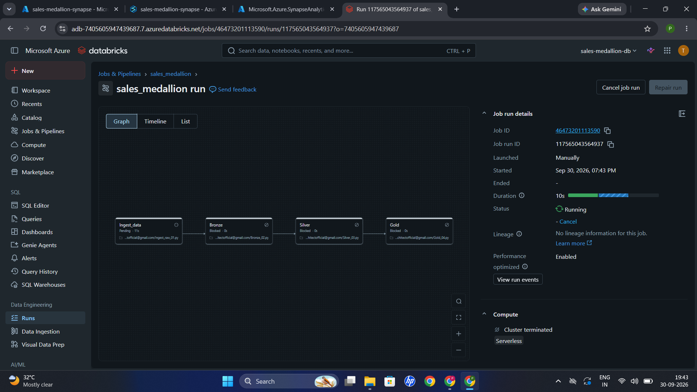

Job run succeeded (all four tasks, about 1m 56s end to end on serverless):

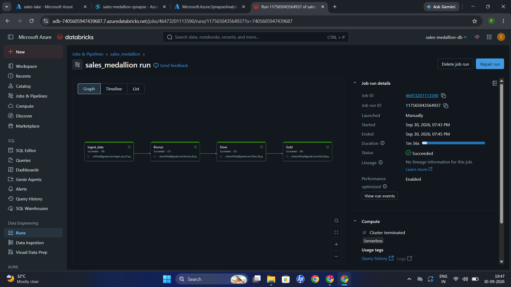

The bundle definition in `resources/sales_medallion_job.yml` describes the same four-task workflow using current serverless task environments. The bundle uses environment version 6 and installs the `requests` dependency for the GitHub ingestion notebook.

## Declarative Automation Bundle

The root `databricks.yml` includes `resources/*.yml` and defines a `dev` target.

Typical lifecycle:

```bash
databricks bundle validate -t dev
databricks bundle deploy -t dev
databricks bundle run -t dev sales_medallion_pipeline
```

The bundle is intended to create a separate deployment-managed Databricks job named `sales-medallion-pipeline-dab`.

## Rebuild checklist

1. Create ADLS Gen2 storage and `sales-lake` container.
2. Create `raw`, `bronze`, `silver`, and `gold` directories.
3. Configure Unity Catalog and an external location covering `sales-lake`.
4. Create `sales_catalog` and the `bronze`, `silver`, and `gold` schemas.
5. Populate the `sales-data-source` repository.
6. Run `01_ingest_raw.py`.
7. Run `02_bronze.py`.
8. Run `03_silver.py`.
9. Run `04_gold.py`.
10. Create the Synapse workspace and grant its managed identity storage read access.
11. Create `SalesMedallion` in Synapse Serverless.
12. Create the master key/credential, `SalesLake` external data source, and Gold views.
13. Validate the DAB with `databricks bundle validate`.
14. Deploy/run the bundle if desired.

## Security

Never commit:

- Databricks access tokens
- Azure credentials
- Synapse master-key passwords
- SHIR keys
- secrets stored in local `.env` files

Use secure secret/credential management in a real deployment.

## Azure DevOps CI/CD

`azure-pipelines.yml` validates and deploys the Databricks bundle. Store `DATABRICKS_HOST`, `DATABRICKS_CLIENT_ID`, and `DATABRICKS_CLIENT_SECRET` in Azure DevOps pipeline variables, with the secret marked as secret. Never commit the client secret.

## Cost control

For a learning project, provisioned resources should be deleted after testing. Keep the GitHub repositories, code, documentation, and screenshots as the durable project record.
