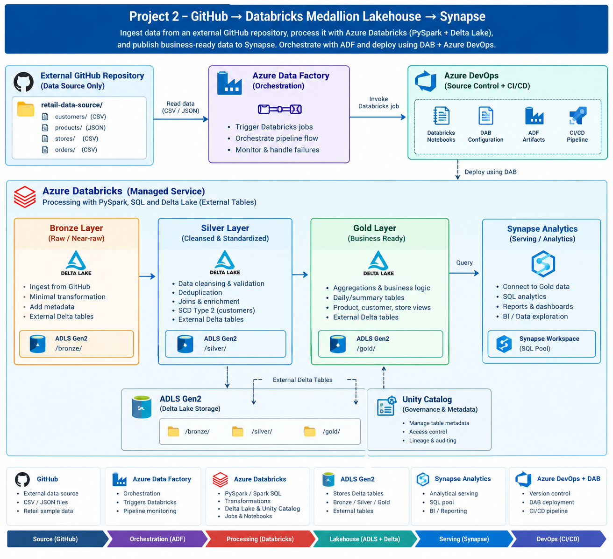

# Architecture



Text version:

```text
External GitHub source data
          |
          v
  Databricks Job (Serverless)
          |
          +--> 01_ingest_raw.py
          |
          +--> 02_bronze.py
          |
          +--> 03_silver.py
          |
          +--> 04_gold.py
          |
          v
      ADLS Gen2
      /        \
   raw/         Delta layers
                bronze/
                silver/
                gold/
                   |
                   v
          Gold Star Schema
          - dim_customer (SCD2)
          - dim_product
          - dim_store
          - dim_date
          - fact_sales
                   |
                   v
        Synapse Serverless SQL
             gold.* views
```

ADF is intentionally not part of the final architecture. It was tested during development but removed because the Databricks Job already orchestrates the end-to-end workload.
